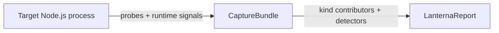

# Architecture

How Lanterna captures profiles, enriches them, and turns raw data into a structured report.

> Field paths in this document use **schema v2**: built-in per-kind data lives under `profiles.<kind>.*` and per-kind meta under `meta.kinds.<kind>.*`. Custom kinds may use a distinct `ProfileKind.reportSectionKey` for their `profiles.*` section. See [report-schema.md](./report-schema.md) for the full shape.

## Overview

Lanterna has two phases:



1. **Capture** — a `ProfileSource` (spawn / attach) hands a live CDP connection to the `runCapture` coordinator. The coordinator runs the installed **profile kinds'** probes against that connection, plus the always-on runtime-signals installer (event-loop + GC). Output: `CaptureBundle = { target, runtimeSignals, kinds, captureIntegrity, … }`.
2. **Enrichment** — each kind contributes its analysis section (`profiles.<reportSectionKey>`), detectors emit cross-kind `findings[]`, and `buildLanternaReport` assembles the final `LanternaReport`.

**Profile kinds** are the extensibility seam. The built-in kinds are `cpu`, `memory`, and `async` (`async` is experimental and opt-in). Domain profilers plug in through the same interface — see [extending/profile-kinds.md](./extending/profile-kinds.md). The CLI selects active kinds with `--kind <id>` (repeatable, default `cpu`); the JSON report lists successfully captured kind ids in `meta.profileKinds` and puts their sections under each kind's `reportSectionKey`.

### Spawn vs attach

The enrichment pipeline is identical between modes. Only capture differs:

| | `spawn` | `attach` |
| --- | --- | --- |
| Entry point | `lanterna run -- <cmd>` | `lanterna attach` |
| Starts the process | Yes | No |
| Startup pause (`--inspect-brk`) | Yes | No |
| Control channel (FD 3) | Yes | No |
| Preload hook | `--require=<tmp.cjs>` | Injected over CDP |
| `--deep` / `--trace-deopt` | Supported | Not supported |
| `meta.command` | Populated | `[]` |

> **Lanterna fails fast.** If the inspector never becomes available, the run fails — it never silently falls back to a weaker profiling mode.

---

## Spawn mode — `lanterna run`

### 1. Compose the preload hook

The coordinator builds a single preload script from the active kinds' hook installers plus the mandatory `runtime-signals` installer (GC observer + event-loop histogram/heartbeat). The composed script is written to a temp `.cjs` file and injected via `NODE_OPTIONS --require=<tmp>`.

> The preload extension is `.cjs` because Lanterna's package is `"type": "module"`. A `.js` preload would be loaded as ESM and `require()` would not work in it. Mechanical detail of composition, not a shipped asset.

### 2. Prepare the target

| Piece | Purpose |
| --- | --- |
| `--inspect-brk=0` | Start the inspector on a random port; pause before user code runs. |
| `--require=<composed preload>` | Inject runtime-signals + any kind hook fragments. |
| `--trace-deopt` | Added only when `--deep` is enabled (CPU kind uses target diagnostics to build `deopts[]`). |
| async await loader | Added only for `--kind async --async-instrumentation=full`; experimental, only affects code loaded after registration. |
| `LANTERNA_ACTIVE=1` | Marker for the child process. |
| `LANTERNA_CONTROL_FD=3` | FD the preload writes control-channel events to. |

The child is spawned with an extra file descriptor (FD 3) used as a **best-effort control channel** for JSON events from the preload.

### 3. Connect to the inspector

Lanterna waits for the inspector WebSocket URL, then connects over CDP. From there it can:

- query runtime metadata,
- drive each probe (e.g. CPU probe: `Profiler.enable` / `Profiler.start` / `Profiler.stop`),
- release the paused process with `Runtime.runIfWaitingForDebugger`,
- query globals published by the preload.

### 4. Runtime-signals installer

The installer does **not** capture CPU samples — that is the CPU probe's job over CDP. Its job is cross-cutting timing signals that any kind can consume for correlation:

- event-loop heartbeat samples (~20 ms),
- event-loop histogram via `monitorEventLoopDelay`,
- GC pause events via `PerformanceObserver`,
- lifecycle events (hook ready, app complete).

Events are emitted over the control FD as JSON lines. The parent treats the channel as best effort: malformed events are ignored, and partial channels still produce a report — `captureIntegrity.*` records what was actually observed.

### 5. Optional readiness and workload orchestration

In `lanterna run`, the CLI can delay the profiling window until the server is actually ready:

1. Lanterna starts the target under the inspector and releases the startup breakpoint.
2. If `--wait-for-url <url>` is set, Lanterna polls that URL until it responds (2xx) or `--wait-timeout` elapses.
3. If `--capture-delay <duration>` is set, Lanterna waits that extra time after readiness.
4. Lanterna starts the capture probes.
5. If `--workload <command>` is set, Lanterna launches it in parallel with the active capture.

This keeps server captures from measuring only startup or idle time. The workload is external to the profiled app; it exists to generate the traffic or job activity being measured.

If the workload exits non-zero, Lanterna still writes the report when possible and then returns an error so automation can fail the run without losing the captured evidence.

### 6. Start capture

Once the inspector is connected, the coordinator:

1. marks the start of the capture in the target runtime (via the preload global),
2. calls each kind probe's `start(ctx)` (CPU: `Profiler.start`).

From that moment, signal families accumulate:

- CPU samples from the V8 profiler (CPU probe),
- event-loop heartbeats + histogram (runtime-signals),
- GC events (runtime-signals),
- async resource records, concurrency samples, and optional safe/full async stacks when `--kind async` is selected.

With `--deep`, V8 deopt traces are also collected from the child's diagnostic output and parsed later into grouped `deopts[]`. V8 may emit those trace lines on stdout or stderr; Lanterna keeps trace diagnostics out of JSON stdout while preserving normal target stdout/stderr.

### 7. Stop capture

Lanterna stops when the requested duration elapses, the target finishes first, or a signal (`SIGINT`/`SIGTERM`) is received. During shutdown it:

- calls each probe's `stop(ctx)` — the CPU probe retrieves the raw CPU profile and (if deep) parses deopts from the diagnostics buffer,
- calls each installed probe's `dispose(ctx)` for best-effort cleanup; failures are isolated into `captureIntegrity.diagnostics[]` as `probe-dispose`,
- reads the final event-loop + GC summaries from the target,
- normalizes timed samples to the capture window,
- merges capture-integrity counters from the control channel + CDP,
- closes the CDP connection,
- gives the process a brief chance to exit cleanly, then escalates to `SIGTERM` and `SIGKILL` if needed.

The output is a `CaptureBundle = { target, startedAtEpoch, durationMs, captureIntegrity, runtimeSignals, kinds }`.

---

## Attach mode — `lanterna attach`

Two entry points:

| Flag | Behavior |
| --- | --- |
| `--pid [pid]` | Open the interactive picker, reuse a detected inspector target in `127.0.0.1:9229..9238`, or send `SIGUSR1` to the pid and wait for an inspector endpoint. |
| `--inspect-url <url>` | Connect directly to a known inspector WebSocket. |

Once connected, attach mode:

1. reads target metadata over CDP,
2. evaluates the composed attach script on the target, installing the runtime-signals framework and any kind fragments in-process through **globals** (no FD 3),
3. drives the same coordinator flow as spawn mode.

> Attach mode reuses the exact same enrichment pipeline as spawn mode. Only capture collection differs — the report schema is identical.

Attach-specific limitations:

- No paused startup phase, no `Runtime.runIfWaitingForDebugger`.
- No FD 3 control channel, so `captureIntegrity.controlChannel` is always `false` and control-channel counters are zero.
- Cannot enable `--trace-deopt`, so `profiles.cpu.deopts` is empty by design.
- `--kind async` is partial: async resources that already existed before hook installation are not observable, and `--async-instrumentation=full` cannot rewrite already-loaded code.
- `meta.command` is empty — Lanterna did not launch the process.

---

## Enrichment pipeline

The pipeline transforms `CaptureBundle` into `LanternaReport` in four phases:

1. **Kind contributors** — each `ProfileKind` writes its report section into `profiles.<reportSectionKey>` and publishes a typed view consumable via `context.forKind(id)`.
2. **Section analyzers** — optional extensions write under `extensions.<namespace>` (not kind-specific).
3. **Finding analyzers** — cross-cutting rules emit `Finding`s, each tagged with a `profileKind` string.
4. **Finalize** — each kind's optional `finalize` hook mutates its own section based on the final findings (e.g. CPU sets `profiles.cpu.summary.dominantBlockingKind` and `topUserHotspot`).

### Frame classification

Each sampled frame is placed into exactly one category — see [kinds/cpu.md](./kinds/cpu.md#frame-classification) for the full table. The same classification feeds memory `hotAllocators` and heap-snapshot retainer paths.

#### Noise filters (extension point)

Self-noise detection lives in a single registry exported from `@lanterna-profiler/core` (`packages/core/src/analysis/noise-filters.ts`). The bundled Lanterna filter is auto-registered on import; analyzers consume the registry through `classifyNoiseUrl`, `classifyNoisePackage`, `isNoiseCategory`, `isNoiseRetainerPath`, and `shouldKeepNoiseFrames` instead of hard-coding patterns.

A profile kind that injects its own JavaScript into the target (e.g. the experimental `async` kind, or a third-party hook kind) can declare its own self-noise without touching the analyzers:

```ts
import { registerNoiseFilter } from '@lanterna-profiler/core';

registerNoiseFilter({
  name: 'async-hooks',
  category: 'lanterna', // adding a new FrameCategory value requires a schema change
  matchUrl(normalizedPath) {
    return normalizedPath.endsWith('/async-hooks-preload.cjs') ? 'async-hooks:preload' : undefined;
  },
  matchRetainerPath(joinedPath) {
    return joinedPath.includes('__ASYNC_HOOKS_RUNTIME__');
  },
});
```

Each filter exposes three optional predicates — `matchUrl`, `matchPackage`, `matchRetainerPath` — and a `category` used to tag matched frames. Filters should be pure and cheap; they run on every classified frame and on every retainer path candidate.

### Hotspots and timed correlation

Raw CPU profiles say *where* CPU time went, not always *when* latency symptoms occurred. Lanterna builds time windows for event-loop stalls and GC pauses, then correlates sampled user-code hotspots with those windows. That lets the report state things like:

- "this user function overlapped most measured stall windows",
- "this hotspot is a likely contributor to GC pressure".

Correlation is conservative: if no single user frame dominates, Lanterna reports ranked candidates rather than over-claiming.

### Findings

Findings are detectors running on the enriched snapshot, not on the raw bundle. Each finding carries a required `profileKind: string` tag so consumers can filter by kind. The full catalog of built-in findings, grouped by kind, lives in [extending/detectors.md](./extending/detectors.md#built-in-findings).

Findings are sorted by `priority.score` first, then by severity and attributed weight. Dominant user-code CPU is exposed as `profiles.cpu.summary.topUserHotspot` for context instead of as an actionable finding.

Built-in findings may also expose:

| Field | Meaning |
| --- | --- |
| `confidence` | Detector-level confidence (`high`, `medium`, `low`). |
| `proofLevel` | Evidence class: `direct-sample`, `correlated-window`, `trace-only`, or `heuristic`. |

These fields are intentionally separate from `severity`: severity estimates impact; confidence and proof level explain how strong the evidence is.

---

## What Lanterna does not do today

- Generate flamegraphs as its primary output.
- Infer source-level fixes by itself. It emits evidence and suggestions; remediation belongs to the user or to an agent consuming the report.
- Provide an in-process programmatic API for inline self-profiling (only spawn and attach are supported today).
- Stream heap snapshots — large snapshots return `heapSnapshotAnalysis.available: false` with a warning instead of being parsed unbounded.
- Support differential CPU profiling between two captures (consumers can diff JSON reports themselves).

---

## See also

- [report-schema.md](./report-schema.md) — what the pipeline writes.
- [signal-quality.md](./signal-quality.md) — `captureIntegrity` and per-kind `quality`.
- [kinds/cpu.md](./kinds/cpu.md) / [kinds/memory.md](./kinds/memory.md) / [kinds/async.md](./kinds/async.md) — per-kind details.
- [extending/profile-kinds.md](./extending/profile-kinds.md) — add a new measurement axis.
- [extending/detectors.md](./extending/detectors.md) — add a new finding rule.
