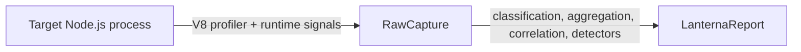

# How Lanterna Works

This document explains the capture flow, the enrichment pipeline, and how Lanterna handles degraded signals.

## Overview

Lanterna has two phases:

1. **Capture** - collect raw CPU samples and timed runtime signals (event-loop, GC, lifecycle).
2. **Enrichment** - classify frames, aggregate hotspots, correlate timed events, run detectors, emit a `LanternaReport`.

The enrichment pipeline is shared. Only capture differs between modes:

| | `spawn` | `attach` |
| --- | --- | --- |
| Entry point | `lanterna run -- <cmd>` | `lanterna attach` |
| Starts the process | Yes | No |
| Startup pause (`--inspect-brk`) | Yes | No |
| Control channel (FD 3) | Yes | No |
| Preload hook | `--require=<hook>` | Injected over CDP |
| `--deep` / `--trace-deopt` | Supported | Not supported |
| `meta.command` | Populated | `[]` |

> [!NOTE]
> If the inspector never becomes available, Lanterna **fails fast**. It never silently falls back to a weaker profiling mode.

---

## Spawn mode - `lanterna run`

### 1. Prepare the target

Before spawning, Lanterna extends `NODE_OPTIONS`:

| Flag | Purpose |
| --- | --- |
| `--inspect-brk=0` | Start the Node inspector on a random port, pause before user code runs. |
| `--require=<event-loop-hook>` | Inject the preload hook. |
| `--trace-deopt` | Added only when `--deep` is enabled. |

And two environment variables:

- `LANTERNA_ACTIVE=1`
- `LANTERNA_CONTROL_FD=3`

The child is spawned with an extra file descriptor (FD 3) used as a **best-effort control channel** for JSON events from the preload hook.

> [!WARNING]
> The preload hook ships as `event-loop-hook.cjs`. The `.cjs` extension is required because Lanterna's package is `"type": "module"` - a `.js` file would be loaded as ESM, and `require()` would not work.

### 2. Connect to the inspector

Lanterna waits for the inspector WebSocket URL, then connects over the Chrome DevTools Protocol. From there it can:

- query runtime metadata
- start/stop the V8 sampling CPU profiler
- release the paused process with `Runtime.runIfWaitingForDebugger`
- query globals published by the preload hook

### 3. Preload hook responsibilities

The hook does **not** capture CPU samples - that comes from V8's profiler over CDP. Its job is the timing signals that the raw CPU profile cannot provide on its own:

- event-loop heartbeat samples (~20 ms)
- event-loop histogram summary via `monitorEventLoopDelay`
- GC pause events via `PerformanceObserver`
- lifecycle events (hook ready, app complete)

These events are emitted over the control FD as JSON lines. The parent treats the channel as best effort: malformed events are ignored, and partial channels still produce a report - `captureIntegrity.*` records what was actually observed.

### 4. Start capture

Once the inspector is connected, Lanterna:

1. marks the start of the capture in the target runtime
2. starts the V8 CPU profiler with the configured sample interval
3. releases the paused process

From that moment, three signal families accumulate:

- CPU samples from the V8 profiler
- event-loop heartbeats + histogram
- GC events

With `--deep`, V8 deopt traces are also collected from the child's `stderr` and parsed later into grouped `deopts[]`.

### 5. Stop capture

Lanterna stops when the requested duration elapses or the target finishes first. During shutdown it:

- reads the final event-loop summary from the target
- stops the CPU profiler and retrieves the raw profile
- normalizes timed samples to the capture window
- closes the CDP connection
- gives the process a brief chance to exit cleanly, then escalates to `SIGTERM` and `SIGKILL` if needed

The output is a `RawCapture`.

---

## Attach mode - `lanterna attach`

Attach mode has two entry points:

| Flag | Behavior |
| --- | --- |
| `--pid [pid]` | Open the interactive picker, reuse a detected inspector target in `127.0.0.1:9229..9238`, or send `SIGUSR1` to the pid and wait for an inspector endpoint. |
| `--inspect-url <url>` | Connect directly to an already-known inspector WebSocket. |

Once connected, attach mode:

1. reads target metadata over CDP
2. injects a small runtime hook that publishes heartbeats and GC events through **globals** (no FD 3)
3. marks capture start in the injected hook
4. starts the V8 sampling profiler
5. waits for the requested duration, target exit, or a manual stop
6. reads timed data back from the globals, stops the profiler, closes the CDP session

> [!TIP]
> Attach mode reuses the exact same enrichment pipeline as spawn mode. The only differences are in how `RawCapture` is collected - the report schema is identical.

Attach mode limitations:

- No paused startup phase, no `Runtime.runIfWaitingForDebugger`.
- No FD 3 control channel, so `captureIntegrity.controlChannel` is always `false`.
- Cannot enable `--trace-deopt`, so `deopts[]` is empty by design.
- `meta.command` is empty - Lanterna did not launch the process.

---

## Enrichment pipeline

The pipeline transforms `RawCapture` into `LanternaReport`.

### Frame classification

Each frame is placed into exactly one category:

| Category | Typical example | Criterion |
| --- | --- | --- |
| `user` | A function inside `target.cwd` | Path is under the target's working directory. |
| `node_modules` | A package dependency | Path contains `node_modules`. |
| `node:builtin` | `node:crypto`, `node:fs` | URL starts with `node:`. |
| `native` | Unnamed runtime/C++ frames | No script URL. |
| `gc` | Garbage collector frames | V8 GC synthetic frames. |
| `program` | `(program)` pseudo-frame | V8 idle/top-of-stack marker. |
| `idle` | `(idle)` pseudo-frame | V8 idle samples. |
| `unknown` | Frames that fit nothing above | Fallback bucket. |

Classification feeds summary ratios and several findings. Lanterna's own preload hook is deliberately classified as internal/native noise, **not** user code.

### Hotspots

Nodes sharing the same `(file, function, line)` are aggregated into a public hotspot:

- direct CPU (`selfMs`, `selfPct`)
- inclusive CPU (`totalMs`, `totalPct`)
- top callers / callees
- optimization state

### Hot stacks

Lanterna keeps the most frequent complete sampled stacks. Useful when a single hotspot is ambiguous and you need the surrounding call path.

### Timed correlation

Raw CPU profiles say *where* CPU time went, not always *when* latency symptoms occurred. Timed runtime signals add the missing dimension.

Lanterna builds time windows for event-loop stalls and GC pauses, then correlates sampled user-code hotspots with those windows. That lets the report state things like:

- "this user function overlapped most measured stall windows"
- "this hotspot is a likely contributor to GC pressure"

Correlation is conservative: if no single user frame dominates, Lanterna reports ranked candidates rather than over-claiming.

### Findings

Findings are detectors running on the enriched report, not on the raw capture. Built-in detectors cover:

- synchronous crypto on the hot path
- blocking sync I/O on the hot path
- CPU-bound user-code hotspots
- repeated `JSON.parse` / `JSON.stringify` on the hot path
- dependency hotspots in `node_modules`
- excessive GC
- event-loop stalls
- repeated deoptimisation loops
- module loading on the hot path

Findings are sorted by severity first, then by attributed CPU weight.

---

## Signal quality

Lanterna exposes several indicators so consumers can judge how trustworthy a report is.

### `meta.captureIntegrity`

| Flag | Meaning |
| --- | --- |
| `controlChannel` | The preload hook successfully talked to the parent (spawn mode only). |
| `eventLoopTimed` | Timed event-loop heartbeat data was observed. |
| `gcTimed` | Timed GC events were observed. |
| `cpuSamplesTimed` | The CPU profile included timing deltas. |

If one of these flags is `false`, the report is still usable - but some interpretation should be more cautious.

### `eventLoop.measurementBasis`

| Value | Strength |
| --- | --- |
| `both` | Heartbeats **and** histogram - strongest. |
| `heartbeats` | Heartbeats only. |
| `histogram` | Histogram only, weaker (no temporal alignment). |
| `none` | No usable signal; `eventLoop.available` is `false`. |

### `eventLoop.confidence`

| Value | When |
| --- | --- |
| `high` | Strongest basis available. |
| `low` | Only a weaker basis was available. |
| `none` | No usable signal. |

Confidence directly affects how strongly Lanterna attributes a stall to a specific user-code hotspot.

---

## Failure and degradation modes

<strong>Inspector unavailable</strong>

Lanterna requires inspector support. If the target runtime cannot start the inspector, the run **fails** instead of pretending to profile.

<strong>Partial preload-hook signal</strong>

If the preload hook loads but a channel degrades:

- the report can still contain CPU hotspots
- event-loop or GC timing may be partial or absent
- `captureIntegrity.*` and `eventLoop.*` show exactly what was lost

<strong>Low-load captures</strong>

A technically valid profile may still be operationally weak:

- high `idleRatio` means the process spent most of the capture idle
- short captures may under-sample real bottlenecks
- with no meaningful workload, the hottest path may just be startup noise

<strong><code>--deep</code> disabled</strong>

Without `--deep`, deopt tracing is intentionally absent. `deopts[]` is empty and no `deopt-loop:*` finding can be emitted.

---

## Extending the pipeline

Lanterna is a monorepo of three packages (`cli → detectors → core`). The analysis pipeline is the extension point:

- `@lanterna/core` exposes `createAnalysisPipeline`, `defineFindingAnalyzer`, and `defineSectionAnalyzer` for full control with no default detectors registered.
- `@lanterna/detectors` wraps the core pipeline with the built-in detector pack. `runProfile` / `attachProfile` accept `detectors`, `analyzers`, and a `setupPipeline` hook so custom rules can be injected at call time. The package also exposes `LanternaDetectorPlugin` — the ES-module contract used by third-party plugins.
- `@lanterna/cli` loads plugins via `--detectors <spec>` (repeatable) or a `.lanterna.json` file and composes them into `setupPipeline` before calling the facades.

See the root README's [Extending Lanterna](../README.md#extending-lanterna) section for the authoring guide.

## What Lanterna does not do today

- Generate flamegraphs as its primary output.
- Infer source-level fixes by itself. It emits evidence and suggestions; remediation belongs to the user or to an agent consuming the report.

---

## Recommended reading order

If you are new to the project:

1. Start with [`README.md`](../README.md) for the quick start and scope.
2. Read [`reading-a-report.md`](reading-a-report.md) to interpret the JSON output.
3. Come back here when you need to understand *why* a specific field or confidence level exists.
