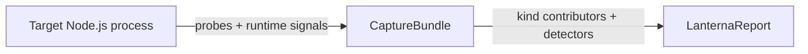

# How Lanterna Works

This document explains the capture flow, the enrichment pipeline, and how Lanterna handles degraded signals.

> Report paths in this document use **schema v2** conventions. CPU-specific sections live under `profiles.cpu.*` (e.g. `profiles.cpu.summary`, `profiles.cpu.eventLoop`, `profiles.cpu.gc`). When the same field name appears below without that prefix, it is shorthand for the fully-qualified CPU path.

## Overview

Lanterna has two phases:

1. **Capture** — a `ProfileSource` (spawn / attach) hands a live CDP connection to the `runCapture` coordinator. The coordinator runs the installed **profile kinds'** probes against that connection, plus the always-on runtime-signals installer (event-loop + GC). Output: `CaptureBundle` — `{ target, runtimeSignals, kinds, captureIntegrity, … }`.
2. **Enrichment** — each kind contributes its analysis section (`profiles.<kind>`), detectors emit cross-kind `findings[]`, and `buildLanternaReport` assembles the final `LanternaReport`.

**Profile kinds** are the extensibility seam. The built-in kind is `cpu`. Future kinds (memory, async) plug in through the same interface: they provide a `CaptureProbe` + `KindAnalysisContributor` and optionally a preload-hook fragment. The CLI selects active kinds with `--kind <id>` (repeatable, default `cpu`); the JSON report lists successfully captured kinds in `meta.profileKinds` and puts their sections under `profiles.<kind>`.

### Spawn vs attach

The enrichment pipeline is identical between modes. Only capture differs:

| | `spawn` | `attach` |
| --- | --- | --- |
| Entry point | `lanterna run -- <cmd>` | `lanterna attach` |
| Starts the process | Yes | No |
| Startup pause (`--inspect-brk`) | Yes | No |
| Control channel (FD 3) | Yes | No |
| Preload hook | `--require=<tmp.cjs>` | Injected over CDP |
| `--deep` / `--trace-deopt` | Supported | Not supported |
| `meta.command` | Populated | `[]` |

> [!NOTE]
> If the inspector never becomes available, Lanterna **fails fast**. It never silently falls back to a weaker profiling mode.

---

## Spawn mode — `lanterna run`

### 1. Compose the preload hook

The coordinator builds a single preload script from the active kinds' hook installers plus the mandatory `runtime-signals` installer (GC observer + event-loop histogram/heartbeat). The composed script is written to a temp `.cjs` file and injected via `NODE_OPTIONS --require=<tmp>`.

> [!NOTE]
> The temp file extension is `.cjs` because Lanterna's package is `"type": "module"`. A `.js` preload would be loaded as ESM and `require()` would not work in it. This is a mechanical detail of composition, not a shipped asset.

### 2. Prepare the target

`NODE_OPTIONS` and env:

| Piece | Purpose |
| --- | --- |
| `--inspect-brk=0` | Start the Node inspector on a random port, pause before user code runs. |
| `--require=<composed preload>` | Inject the runtime-signals installer + any kind hook fragments. |
| `--trace-deopt` | Added only when `--deep` is enabled (CPU kind uses stderr to build `deopts[]`). |
| `LANTERNA_ACTIVE=1` | Marker for the child process. |
| `LANTERNA_CONTROL_FD=3` | FD the preload writes control-channel events to. |

The child is spawned with an extra file descriptor (FD 3) used as a **best-effort control channel** for JSON events from the preload.

### 3. Connect to the inspector

Lanterna waits for the inspector WebSocket URL, then connects over the Chrome DevTools Protocol. From there it can:

- query runtime metadata
- drive each probe (e.g. CPU probe: `Profiler.enable` / `Profiler.start` / `Profiler.stop`)
- release the paused process with `Runtime.runIfWaitingForDebugger`
- query globals published by the preload

### 4. Runtime-signals installer responsibilities

The installer does **not** capture CPU samples — that's the CPU probe's job over CDP. Its job is cross-cutting timing signals that any kind can consume for correlation:

- event-loop heartbeat samples (~20 ms)
- event-loop histogram summary via `monitorEventLoopDelay`
- GC pause events via `PerformanceObserver`
- lifecycle events (hook ready, app complete)

These events are emitted over the control FD as JSON lines. The parent treats the channel as best effort: malformed events are ignored, and partial channels still produce a report — `captureIntegrity.*` records what was actually observed.

### 5. Start capture

Once the inspector is connected, the coordinator:

1. marks the start of the capture in the target runtime (via the preload global)
2. calls each kind probe's `start(cdp)` (for CPU: `Profiler.start`)
3. releases the paused process

From that moment, signal families accumulate:

- CPU samples from the V8 profiler (CPU probe)
- event-loop heartbeats + histogram (runtime-signals)
- GC events (runtime-signals)

With `--deep`, V8 deopt traces are also collected from the child's `stderr` and parsed later into grouped `deopts[]`.

### 6. Stop capture

Lanterna stops when the requested duration elapses, the target finishes first, or a signal (SIGINT/SIGTERM) is received. During shutdown it:

- calls each probe's `stop(cdp)` — the CPU probe retrieves the raw CPU profile and (if `deep`) parses deopts from the stderr buffer
- reads the final event-loop + GC summaries from the target
- normalizes timed samples to the capture window
- merges capture-integrity counters from the control channel + CDP
- closes the CDP connection
- gives the process a brief chance to exit cleanly, then escalates to `SIGTERM` and `SIGKILL` if needed

The output is a `CaptureBundle` — `{ target, startedAtEpoch, durationMs, captureIntegrity, runtimeSignals, kinds }`.

---

## Attach mode — `lanterna attach`

Attach mode has two entry points:

| Flag | Behavior |
| --- | --- |
| `--pid [pid]` | Open the interactive picker, reuse a detected inspector target in `127.0.0.1:9229..9238`, or send `SIGUSR1` to the pid and wait for an inspector endpoint. |
| `--inspect-url <url>` | Connect directly to an already-known inspector WebSocket. |

Once connected, attach mode:

1. reads target metadata over CDP
2. evaluates the composed attach script on the target, installing the runtime-signals framework and any kind fragments in-process through **globals** (no FD 3)
3. drives the same coordinator flow as spawn mode

> [!TIP]
> Attach mode reuses the exact same enrichment pipeline as spawn mode. Only capture collection differs — the report schema is identical.

Attach mode limitations:

- No paused startup phase, no `Runtime.runIfWaitingForDebugger`.
- No FD 3 control channel, so `captureIntegrity.controlChannel` is always `false` and control-channel counters are zero.
- Cannot enable `--trace-deopt`, so `profiles.cpu.deopts` is empty by design.
- `meta.command` is empty — Lanterna did not launch the process.

---

## Enrichment pipeline

The pipeline transforms `CaptureBundle` into `LanternaReport` in four phases:

1. **Kind contributors** — each `ProfileKind` writes its report section into `profiles.<kind>` and publishes a typed view consumable via `context.forKind(id)`.
2. **Section analyzers** — optional extensions write under `extensions.<namespace>` (not kind-specific).
3. **Finding analyzers** — cross-cutting rules emit `Finding`s, each tagged with a `profileKind` string.
4. **Finalize** — each kind's optional `finalize` hook mutates its own section based on the final findings (e.g. CPU sets `profiles.cpu.summary.dominantBlockingKind` and `topUserHotspot`).

### Frame classification (CPU kind)

Each sampled frame is placed into exactly one category:

| Category | Typical example | Criterion |
| --- | --- | --- |
| `user` | A function inside `target.cwd` | Path is under the target's working directory. |
| `node_modules` | A package dependency | Path contains `node_modules`. |
| `node:builtin` | `node:crypto`, `node:fs` | URL starts with `node:`. |
| `native` | Unnamed runtime/C++ frames | No script URL. |
| `gc` | Garbage collector frames | V8 GC synthetic frames. |
| `program` | `(program)` pseudo-frame | V8 idle/top-of-stack marker. |
| `idle` | `(idle)` pseudo-frame | V8 idle samples. |
| `unknown` | Frames that fit nothing above | Fallback bucket. |

Classification feeds `profiles.cpu.summary` ratios and several findings. The runtime-signals installer itself is deliberately classified as internal/native noise, **not** user code.

### Hotspots

Nodes sharing the same `(file, function, line)` are aggregated into a public hotspot under `profiles.cpu.hotspots`:

- direct CPU (`selfMs`, `selfPct`)
- inclusive CPU (`totalMs`, `totalPct`)
- top callers / callees
- optimization state

### Hot stacks

`profiles.cpu.hotStacks` keeps the most frequent complete sampled stacks. Useful when a single hotspot is ambiguous and you need the surrounding call path.

### Timed correlation

Raw CPU profiles say *where* CPU time went, not always *when* latency symptoms occurred. Timed runtime signals add the missing dimension.

Lanterna builds time windows for event-loop stalls and GC pauses, then correlates sampled user-code hotspots with those windows. That lets the report state things like:

- "this user function overlapped most measured stall windows"
- "this hotspot is a likely contributor to GC pressure"

Correlation is conservative: if no single user frame dominates, Lanterna reports ranked candidates rather than over-claiming.

### Findings

Findings are detectors running on the enriched snapshot, not on the raw bundle. Each finding carries a required `profileKind: string` tag so consumers can filter by kind. Built-in detectors cover:

- synchronous crypto on the hot path
- blocking sync I/O on the hot path
- repeated `JSON.parse` / `JSON.stringify` on the hot path
- dependency hotspots in `node_modules`
- excessive GC
- event-loop stalls
- repeated deoptimisation loops
- module loading on the hot path

Findings are sorted by `priority.score` first, then by severity and attributed CPU weight. Dominant user-code CPU is exposed as `profiles.cpu.summary.topUserHotspot` for context instead of as an actionable finding.

---

## Signal quality

Lanterna exposes several indicators so consumers can judge how trustworthy a report is.

### `meta.captureIntegrity`

| Flag | Meaning |
| --- | --- |
| `controlChannel` | The preload hook successfully talked to the parent (spawn mode only). |
| `eventLoopTimed` | Timed event-loop heartbeat data was observed. |
| `gcTimed` | Timed GC events were observed. |
| `kinds.cpu.samplesTimed` | The CPU profile included timing deltas (under `meta.captureIntegrity.kinds.cpu`). |

If one of these flags is `false`, the report is still usable — but some interpretation should be more cautious.

### `profiles.cpu.eventLoop.measurementBasis`

| Value | Strength |
| --- | --- |
| `both` | Heartbeats **and** histogram — strongest. |
| `heartbeats` | Heartbeats only. |
| `histogram` | Histogram only, weaker (no temporal alignment). |
| `none` | No usable signal; `eventLoop.available` is `false`. |

### `profiles.cpu.eventLoop.confidence`

| Value | When |
| --- | --- |
| `high` | Strongest basis available. |
| `low` | Only a weaker basis was available. |
| `none` | No usable signal. |

Confidence directly affects how strongly Lanterna attributes a stall to a specific user-code hotspot.

---

## Failure and degradation modes

<strong>Inspector unavailable</strong>

Lanterna requires inspector support. If the target runtime cannot start the inspector, the run **fails** instead of pretending to profile.

<strong>Partial preload signal</strong>

If the preload loads but a channel degrades:

- the report can still contain CPU hotspots
- event-loop or GC timing may be partial or absent
- `captureIntegrity.*` and `profiles.cpu.eventLoop.*` show exactly what was lost

<strong>Low-load captures</strong>

A technically valid profile may still be operationally weak:

- high `profiles.cpu.summary.idleRatio` means the process spent most of the capture idle
- short captures may under-sample real bottlenecks
- with no meaningful workload, the hottest path may just be startup noise

<strong><code>--deep</code> disabled</strong>

Without `--deep`, deopt tracing is intentionally absent. `profiles.cpu.deopts` is empty and no `deopt-loop:*` finding can be emitted.

---

## Extending the pipeline

Lanterna is a monorepo of three packages. `core` owns capture orchestration, profile kinds, analysis, and report construction; `detectors` supplies the default CPU detector pack; `cli` wires both together. Two extension seams exist:

- **Detectors** — add finding analyzers.
  - `@lanterna-profiler/core` exposes `createAnalysisPipeline`, `defineFindingAnalyzer`, `defineSectionAnalyzer`, and the kind-scoped seam (`KindScopedDetector<K>` + `createFindingAnalyzerFromKindScopedDetector`) for typed detectors against any profile kind.
  - `@lanterna-profiler/core` exposes `runProfile` / `attachProfile`, which accept `extraAnalyzers` and a `setupPipeline` hook so custom rules can be injected at call time.
  - `@lanterna-profiler/detectors` exposes the built-in CPU detector pack, `createCpuProfileKindWithBuiltInDetectors(...)` (CPU kind pre-wired with the pack), and attribution helpers (`buildAttributedFinding`, `resolveAttribution`, `buildAttributionEvidence`, `CpuHotspotContext`).
  - `@lanterna-profiler/cli` loads plugins via `--detectors <spec>` (repeatable) or a `.lanterna.json` file and composes them into `setupPipeline` before calling core orchestration.
- **Profile kinds** — add a new axis of measurement (memory, async, …).
  - Implement a `ProfileKind` (probe + contributor + optional hook installer + `reportSchema` + optional `contributeMeta`/`contributeIntegrity`/`builtInAnalyzers`) in your own package.
  - Register it via `createKindRegistry([myKind, ...])` from `@lanterna-profiler/core` or pass it directly in `runProfile({ kinds: [...] })`.
  - A plugin module loaded by the CLI can also export `export const kinds: ProfileKind[]` (named export) — `lanterna run --kind <id> --detectors <pkg>` then resolves `<id>` to the plugin-provided kind.
  - The built-in CPU kind (`createCpuProfileKind`) is a reference implementation; pair it with `withBuiltInCpuDetectors(kind)` (or use the one-shot `createCpuProfileKindWithBuiltInDetectors`) to attach the default detector pack.

See the root README's [Extending Lanterna](../README.md#extending-lanterna) section for the detector-plugin authoring guide.

## What Lanterna does not do today

- Generate flamegraphs as its primary output.
- Infer source-level fixes by itself. It emits evidence and suggestions; remediation belongs to the user or to an agent consuming the report.
- Capture memory or async profiles — the architecture is wired for it, but no such kinds ship yet.

---

## Recommended reading order

If you are new to the project:

1. Start with [`README.md`](../README.md) for the quick start and scope.
2. Read [`reading-a-report.md`](reading-a-report.md) to interpret the JSON output.
3. Come back here when you need to understand *why* a specific field or confidence level exists.
